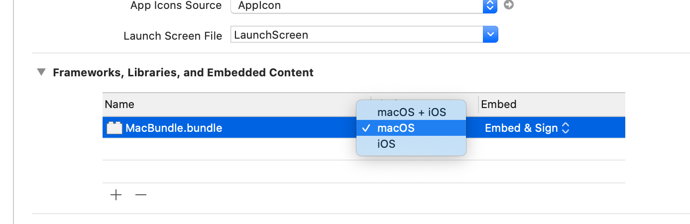

# MacAPIsInCatalyst

Demo of running an AppKit bundle from a Catalyst app.  Following the guides found here [High Caffeine Content](https://www.highcaffeinecontent.com/blog/20190607-Beyond-the-Checkbox-with-Catalyst-and-AppKit) and here [Crunchy Bagel](https://crunchybagel.com/disabling-the-mac-zoom-maximise-button-in-catalyst/).

### 1. Add a macOS bundle
### 2. Link it to the main app



### 3. Create a new Objective-C class in the bundle

This class will access the macOS only APIs

`MacBundle.h`

```objc
#import <Foundation/Foundation.h>

NS_ASSUME_NONNULL_BEGIN

@interface MacBundle : NSObject

+ (NSDictionary *)runShell:(NSArray<NSString *> *)arguments workingDirectory:(NSURL *)workingDir;

@end

NS_ASSUME_NONNULL_END
```

`MacBundle.m`

```objc
#import "MacBundle.h"

@implementation MacBundle

+ (NSDictionary *)runShell:(NSArray<NSString *> *)arguments workingDirectory:(NSURL *)workingDir {
  NSTask *task = [[NSTask alloc] init];
  task.launchPath = @"/usr/bin/env";

  [task setCurrentDirectoryPath:workingDir.path];

  NSPipe * output = [NSPipe pipe];
  [task setStandardOutput:output];

  task.arguments = arguments;
  [task launch];
  [task waitUntilExit];

  NSFileHandle * read = [output fileHandleForReading];
  NSData * dataRead = [read readDataToEndOfFile];
  NSString * stringRead = [[NSString alloc] initWithData:dataRead encoding:NSUTF8StringEncoding];

  return @{
    @"output": stringRead,
    @"code": @(task.terminationStatus)
  };
}

@end
```

### 4. Set the name of this class in your bundle's Info.plist for the key "Principal Class"

### 5. Call this code from the main app target

```swift
#if targetEnvironment(macCatalyst)
let pluginPath = (Bundle.main.builtInPlugInsURL?.appendingPathComponent("MacBundle.bundle").path)!
let bundle = Bundle(path: pluginPath)!
bundle.load()

// Load the principal class from the bundle
// This is set in MacBundle/Info.plist
let principalClass = bundle.principalClass as AnyObject as! NSObjectProtocol

let workingDir = FileManager.default.temporaryDirectory

// Add an example file for "ls" to return below
try! "testing".write(to: workingDir.appendingPathComponent("test.txt"), atomically: true, encoding: .utf8)

let selector = NSSelectorFromString("runShell:workingDirectory:")
let result = principalClass.perform(selector, with: ["ls"], with: workingDir)!.takeUnretainedValue() as! [String: Any]
let code = result["code"] as! Int
let output = result["output"] as! String
print(code, output)
#endif
```